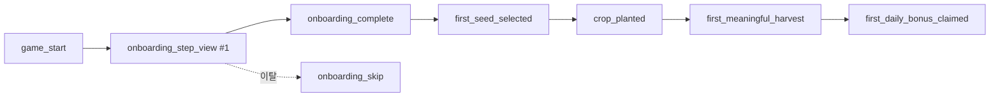

# 핵심 퍼널 분석 기준 (Funnel Analytics)

happy-farm 활성화·리텐션 퍼널 측정의 단일 기준 문서. 이벤트 계약은
`packages/farm-core/src/analytics.ts`(`createFarmAnalytics`)에 정의돼 있고,
발화 지점은 대부분 `packages/farm-ui/src/FarmGame.tsx`다. 광고 퍼널은 별도
문서(`docs/04-work/ad-analytics.md`)를 참조한다. (관련 이슈: [I1] #107)

## 핵심 원칙
- **게임 상태를 아는 지점에서 발화하는 모든 퍼널 이벤트는 `GameAnalyticsContext`를 함께 싣는다.**
  코호트(골드·밭 수·프레스티지·누적 수확 등)별로 퍼널 전환율을 분해할 수 있다.
  단 앱 로드 이전에 발생할 수 있는 이벤트(`notification_opened`)는 예외다.
- **"첫 …" 단계는 전용 이벤트 + 플래그를 함께 둔다.** 첫 수확은
  `first_meaningful_harvest`(전용) + `crop_harvested.is_first_*`(플래그), 첫 데일리
  클레임은 `first_daily_bonus_claimed`(전용) + `daily_bonus_claimed.is_first_claim`(플래그)로
  대칭을 맞춘다. 전용 이벤트는 퍼널 분자(count)로, 플래그는 원본 이벤트 위 세그먼트로 쓴다.
- 이벤트명·파라미터는 snake_case, 값은 string·number·boolean만 사용한다(boolean은
  `toFirebaseAnalyticsValue`가 1/0으로 정규화).

## GameAnalyticsContext (모든 퍼널 이벤트 공통 파라미터)
`getGameAnalyticsContext(gameState, sessionStartedAt, now)`가 생성한다.

| 필드 | 의미 |
|---|---|
| `gold` | 현재 골드(floor) |
| `plot_count` | 해금된 밭 수 |
| `speed_level` / `profit_level` | 성장속도·수익 업그레이드 레벨 |
| `unlocked_area_count` | 해금된 구역 수 |
| `harvested_crop_count` | 도감상 수확 경험이 있는 작물 종 수 |
| `session_elapsed_sec` | 현재 세션 경과 초 |
| `prestige_level` / `prestige_stars` | 프레스티지 레벨·누적 별 |
| `research_points` | 연구 포인트(floor) |
| `lifetime_harvests` | 생애 누적 수확 횟수 |

## 활성화 퍼널 (신규 → 첫 수확 → 첫 데일리)
표준 활성화 경로. 각 단계는 앞 단계 대비 전환율로 읽는다.

| 단계 | 이벤트 | 주요 파라미터 |
|---|---|---|
| 게임 시작 | `game_start` | context |
| 온보딩 시작 | `onboarding_step_view` (`step_index` = 1) | `step`, `step_index`, context |
| 온보딩 각 단계 | `onboarding_step_view` | `step`, `step_index`, context |
| 온보딩 이탈 | `onboarding_skip` | `skipped_step`, `step_index`, context |
| 온보딩 완료 | `onboarding_complete` | context |
| 첫 씨앗 선택 | `first_seed_selected` (이후는 `seed_selected`) | `crop`, `area`, context |
| 심기 | `crop_planted` | `crop`, `area`, `crop_tier`, `crop_cost`, context |
| 수확 준비 | `crop_ready` | `crop`, `area`, `crop_tier`, context |
| 수확 | `crop_harvested` | `crop`, `area`, `crop_tier`, `revenue`, `is_first_crop_harvest`, `is_first_meaningful_harvest`, context |
| **첫 유의미 수확** | `first_meaningful_harvest` | `crop`, `area`, `crop_tier`, `revenue`, context |
| 데일리 보너스 수령 | `daily_bonus_claimed` | `streak`, `reward_value`, `is_first_claim`, context |
| **첫 데일리 클레임** | `first_daily_bonus_claimed` | `streak`, `reward_value`, context |

> **온보딩 "시작"**은 별도 이벤트가 아니라 `onboarding_step_view`의 `step_index = 1` 발화로
> 정의한다. "완료"는 마지막 단계 노출과 구분되는 별도 종료 시점이므로 전용
> `onboarding_complete`를 둔다(건너뛰기로 끝나면 `onboarding_skip`만 발화).



## 리텐션 · 복귀 퍼널
복귀 넛지(알림) → 앱 오픈 → 복귀 요약 → 첫 행동 경로.

| 단계 | 이벤트 | 주요 파라미터 |
|---|---|---|
| 복귀 알림 예약 | `notification_scheduled` | `notification_kind`, `lead_time_ms?`, context? |
| 복귀 알림 열림 | `notification_opened` | `notification_kind` (context 없음) |
| 복귀 요약 노출 | `return_summary_shown` | `away_ms`, `offline_gold`, `ready_crop_count`, context |
| 복귀 요약 수령 | `return_summary_collected` | `away_ms`, `offline_gold`, `ready_crop_count`, context |
| 오늘의 작물 수확 | `crop_of_the_day_harvested` | `crop`, `multiplier`, context |

`notification_kind` 값: `harvest`, `daily_bonus`, `crop_of_the_day`.

### D1(익일) 복귀
D1 복귀는 전용 클라이언트 이벤트가 아니라 **`game_start`의 일별 코호트에서 파생**한다.
사용자의 최초 `game_start`(또는 GA4 자동 `first_open`) 일자를 코호트 기준일로 잡고,
그 다음 날 `game_start`가 있으면 D1 복귀로 집계한다. 세션 진입마다 항상 `game_start`가
context와 함께 발화하므로 별도 이벤트 없이 코호트·채널 귀속 분석이 가능하다.

```sql
-- D1 복귀율: 최초 접속 다음 날 game_start가 있는 사용자 비율 (GA4 BigQuery export)
WITH first_seen AS (
  SELECT user_pseudo_id, MIN(DATE(TIMESTAMP_MICROS(event_timestamp))) AS d0
  FROM `happy-farm-tycoon.analytics_539626577.events_*`
  WHERE event_name = 'game_start'
  GROUP BY user_pseudo_id
),
returns AS (
  SELECT DISTINCT user_pseudo_id, DATE(TIMESTAMP_MICROS(event_timestamp)) AS d
  FROM `happy-farm-tycoon.analytics_539626577.events_*`
  WHERE event_name = 'game_start'
)
SELECT
  f.d0,
  COUNT(DISTINCT f.user_pseudo_id) AS cohort,
  COUNT(DISTINCT r.user_pseudo_id) AS d1_returned,
  SAFE_DIVIDE(COUNT(DISTINCT r.user_pseudo_id), COUNT(DISTINCT f.user_pseudo_id)) AS d1_rate
FROM first_seen f
LEFT JOIN returns r
  ON f.user_pseudo_id = r.user_pseudo_id AND r.d = DATE_ADD(f.d0, INTERVAL 1 DAY)
GROUP BY f.d0
ORDER BY f.d0;
```

## 파생 지표 (대시보드 기준)
- **온보딩 단계 도달률** = 각 `step_index`별 `onboarding_step_view` 고유 사용자 / `game_start` 고유 사용자
- **온보딩 완료율** = `onboarding_complete` / `onboarding_step_view`(step_index=1)
- **첫 심기 활성화율** = `crop_planted` 고유 사용자 / `game_start` 고유 사용자
- **첫 수확 도달률** = `first_meaningful_harvest` / `game_start`
- **첫 데일리 클레임율** = `first_daily_bonus_claimed` / `first_meaningful_harvest`
- **복귀 요약 수령률** = `return_summary_collected` / `return_summary_shown`
- **D1 복귀율** = 위 SQL 참조

## 변경 시 유지할 것
- 새 퍼널 단계 이벤트를 추가하면 이 표와 대응 이벤트 이름을 함께 갱신한다.
- 게임 상태를 아는 지점의 이벤트에는 항상 `GameAnalyticsContext`(스프레드)를 싣는다.
  이 정합성은 `packages/farm-core/src/__tests__/analytics.test.ts`의 퍼널 컨텍스트
  테스트로 회귀 방지한다.
- "첫 …" 단계는 전용 이벤트 + 원본 이벤트 플래그 대칭 패턴을 유지한다.
