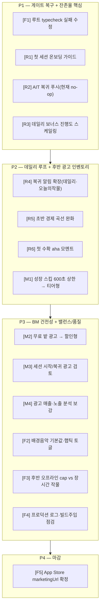

# Happy Farm 론칭/개선 마스터 태스크 목록

> 목적: 광고 BM 점검 + 잔존율(Retention) 개선을 중심으로 한 론칭 백로그.
> 우선순위 축: **잔존율(R) > 수익화(M) > 기능·품질(F)**. 이슈 라벨 `P1`~`P4` 순으로 자율 스케줄러가 1개씩 처리.
> 근거: 2026-06 잔존율 코호트 분석 + 코드 스캔(아래 "분석 근거" 참조).

## 우선순위 한눈 보기

---

## 분석 근거 (요약)

**잔존율 코호트 (2026-06, 327명):** 헤드라인 D1 28% / D7 16% / D14 5%. 단, 06-06(58명)·06-07(57명) 두 대형 코호트가 D1 12~17%로 평균을 끌어내림(전체의 35%). 06-08 이후 코호트는 D1 25~78%로 건강 → 최근 기능 머지 후 **잔존율 개선 추세**. 남은 핵심 누수: ① 신규 온보딩 진입·첫 수확 전환, ② 복귀 유도 약함(AIT 푸시 no-op, 데일리보너스 미스케일).

**광고 BM:** 지면 5개(보상골드/무료밭/성장스킵/수확2배/마일스톤). 보상 골드는 다음 목표 5%로 스케일링 양호. 문제: 성장 스킵 600초 상한으로 후반 미발동, 무료 밭 광고가 골드 경제 잠식, 세션 시작 광고 없음.

---

## 잔존율 (Retention)

### [R1] 첫 세션 온보딩 가이드 — `P1` · M
- **현황:** 기본 가이드(#91, 06-22), 첫 파종 유도·단계 계측(#160, 06-28), 바로 시작 CTA·stall 계측(#277, 07-07)은 반영됨. 다만 2026-06-10~07-07 혼합 기간에 `first_open` 33 → 온보딩 14 → 씨앗 8 → 파종 6 → 첫 수확 3, D1 0/14가 측정됨(#286). 세 배포 전·후가 섞인 소표본이므로 현재 버전의 성능으로 단정하지 않는다.
- **할 일:** 명시적 미완료 사용자에게 가이드를 항상 시작하고, `씨앗 선택 → 파종 → 수확 → 보상 확인`을 저장·재개한다. skip은 harvest 단계의 명시적 확인 후만 허용한다.
- **인수조건:**
  - [x] 신규/미완료 진입 시 씨앗 선택→파종→수확→보상 확인 코치마크 노출
  - [x] 단계 저장·재개, 완료/skip 후 재노출 방지
  - [x] AIT/모바일 공유 UI 동작 및 ko-KR/en-US catalog 일치
  - [ ] 배포 후 `onboarding_step_view / first_open` 90% 이상 확인
  - [ ] 배포 후 `first_meaningful_harvest / first_open` 30% 이상 확인
- **관련 파일:** `packages/farm-ui/src/FarmGame.tsx`, `packages/farm-core/src/types.ts`(플래그), `packages/farm-*/src/i18n/`

### [R2] AIT 복귀 푸시 알림 구현 — `P1` · M
- **현황:** 모바일은 `@notifee`로 수확 알림 동작. **AIT는 `defaultFarmNotifications`(no-op)** → AppsInToss 유저 재방문 넛지 0 (`apps/ait/src/pages/index.tsx:40-48`, `FarmGame.tsx:408-413`).
- **할 일:** AppsInToss(Granite) 프레임워크의 로컬 알림/푸시 API 가용성을 먼저 확인하고, 지원 시 수확 준비 알림 배선. **미지원이면** 대체안(미니앱 재진입 시 인앱 복귀 보상 강화)으로 피벗하고 그 결론을 PR에 기록.
- **인수조건:**
  - [ ] AppsInToss 알림/푸시 API 지원 여부 조사 결과를 PR에 명시
  - [ ] (지원 시) `FarmGameNotifications` 실제 구현체를 AIT에 주입, 수확 준비 알림 발송
  - [ ] (미지원 시) 인앱 복귀 보상/넛지 대체 구현
  - [ ] 권한/설정 토글 일관성 유지
- **관련 파일:** `apps/ait/src/pages/index.tsx`, `apps/ait/src/farm/platform/`, `packages/farm-ui/src/FarmGame.tsx`
- **참고:** API 미지원 확인 시 `blocked` 라벨로 전환 가능.

### [R3] 데일리 보너스 진행도 스케일링 — `P1` · S
- **현황:** 데일리 보너스 50/75/100G **고정**(`dailyBonus.ts:14-18`). 광고 골드는 다음 목표 5%로 스케일링되어 후반 수천만 배 격차 → 출석 동기 소멸.
- **할 일:** 데일리 보너스 금액을 진행도(다음 목표/프레스티지)에 비례하도록 스케일링. `getRewardedGoldAmount` 로직 재사용/참고하되 광고 보상보다 낮게 설계(광고 인센티브 유지).
- **인수조건:**
  - [ ] 보너스 금액이 진행도에 따라 증가(초반 체감 유지, 후반 유의미)
  - [ ] 광고 보상 < 데일리 보너스가 되지 않도록 상한/비율 설정
  - [ ] 스트릭 보너스 구조 유지
  - [ ] `pnpm check:core` 테스트 추가/통과
- **관련 파일:** `packages/farm-core/src/dailyBonus.ts`, `balance.json`, `__tests__/`

### [R4] 복귀 유도 알림 확장 — `P2` · S
- **현황:** `scheduleHarvestReady`는 "다음 1개 작물 수확 준비"만 발송(`FarmGame.tsx:448-468`). 정작 매일 돌아올 이유(데일리 보너스·오늘의 작물)에는 알림 없음.
- **할 일:** 모바일 알림에 ① 데일리 보너스 수령 가능 ② 오늘의 작물 갱신 알림 추가. 중복/스팸 방지 스케줄링.
- **인수조건:**
  - [ ] 데일리 보너스 쿨다운 만료 시점 알림
  - [ ] 오늘의 작물 윈도우 알림(과도하지 않게)
  - [ ] 설정에서 토글 가능, 기존 수확 알림과 충돌 없음
  - [ ] i18n 통과
- **관련 파일:** `apps/mobile/src/notifications/harvestNotifications.ts`, `packages/farm-ui/src/FarmGame.tsx`, `dailyBonus.ts`, `cropOfTheDay.ts`

### [R5] 초반 경제 곡선 완화 — `P2` · M
- **현황:** 시작 50G·6밭, 첫 채소밭 해금 300G. 초보 밭만으로는 누적 ~146G로 부족 → 광고/장시간 의존 추정(`constants.ts:596-622`, `balance.json:13-26`). 첫 10분이 지루하면 D0 이탈.
- **할 일:** 첫 지역 해금까지의 곡선을 검증하고, 광고 없이도 합리적 시간 내 도달 가능하도록 초기 보상/가격/해금 비용 조정. (광고는 "가속" 수단으로 유지, "필수"는 제거)
- **인수조건:**
  - [ ] 광고 0회로 첫 채소밭 해금까지 걸리는 시간/사이클 수를 측정해 PR에 기록
  - [ ] 목표: 무광고로도 첫 세션 내 또는 둘째 세션 초반 해금 가능
  - [ ] 밸런스 테스트(`check:core`) 통과
- **관련 파일:** `packages/farm-core/src/balance.json`, `constants.ts`

### [R6] 첫 수확 aha 모멘트 강화 — `P2` · S
- **현황:** celebration이 특정 새 작물 첫 발견 시에만 트리거. 게임 시작 직후 당근 첫 수확엔 강한 피드백 없음(`FarmGame.tsx:641-658`).
- **할 일:** 생애 첫 수확에 짧은 축하/보상 강조 연출 추가.
- **인수조건:**
  - [ ] 최초 수확 1회에 특별 피드백(연출·골드 강조) 노출
  - [ ] 1회성, 이후 일반 수확과 동일
- **관련 파일:** `packages/farm-ui/src/FarmGame.tsx`

---

## 수익화 (Monetization / 광고 BM)

### [M1] 성장 스킵 광고 600초 상한 → 티어형 단축 — `P2` · S
- **현황:** 성장 스킵 광고는 잔여 4초~**600초**일 때만 노출(`balance.json` growthAd*). 후반 작물(수십 분~4일)은 조건 미충족 → 광고 인벤토리 소멸.
- **할 일:** 상한 제거 또는 "광고 1회 = N분/N% 단축" 티어형으로 변경해 후반에도 노출.
- **인수조건:**
  - [ ] 장시간 작물에서도 스킵 광고 노출(즉시 완성 대신 부분 단축 허용)
  - [ ] 일일 한도/쿨다운 유지, 경제 폭주 방지
  - [ ] 분석 이벤트 placement 유지
- **관련 파일:** `packages/farm-core/src/constants.ts`, `balance.json`, `packages/farm-ui/src/FarmGame.tsx`

### [M2] 무료 밭 해금 광고 → 할인형 — `P3` · S
- **현황:** 광고 1회로 밭 +1 무료 지급(최대 24). 밭은 골드 싱크인데 무료 지급이 경제를 잠식(`FarmGame.tsx:2155-2165`).
- **할 일:** "광고 시청 → 밭 구매 비용 할인" 또는 일일 1회 등으로 재설계.
- **인수조건:**
  - [ ] 무제한 무료 지급 제거(할인 또는 강한 한도)
  - [ ] 진행 동기 유지하면서 골드 싱크 보존
- **관련 파일:** `packages/farm-ui/src/FarmGame.tsx`, `constants.ts`

### [M3] 세션 시작/복귀 광고 검토 — `P3` · M
- **현황:** 앱 진입/복귀 시 광고 지면 없음. 리텐션이 받쳐주면 안정적 임프레션 소스.
- **할 일:** 복귀 요약(welcomeBack) 시점 등에 보상형/전면 광고를 비침습적으로 검토·도입(빈도 제한 필수).
- **인수조건:**
  - [ ] 복귀 시 광고 1개(보상형 권장), 강한 빈도 제한
  - [ ] 첫 세션/온보딩 중에는 미노출
- **관련 파일:** `packages/farm-ui/src/FarmGame.tsx`, `apps/*/src/ads|platform`

### [M4] 광고 매출·노출 분석 보강 — `P3` · S
- **현황:** ad_reward_* 이벤트는 있으나 ARPDAU·placement별 fill/노출 모니터링 미흡.
- **할 일:** placement별 노출/완료/실패율, 일일 광고 수익 추정 지표 추가.
- **인수조건:**
  - [ ] placement별 impression/complete/fail 집계 가능 이벤트 정비
  - [ ] 분석 문서/대시보드 기준 정리
- **관련 파일:** `packages/farm-core/src/analytics.ts`, `ads.ts`

### [M8] 광고 제거 IAP / 보상 패스 BM 검토(스파이크) — `P3` · M
- **현황:** 수익화가 광고 only. 광고 거부 성향 유저를 흡수할 비광고 옵션 미검토.
- **할 일:** 광고 제거 IAP/보상 패스 타당성 스파이크(LTV·캐니벌라이제이션·구현 비용)와 후속 범위 정의.
- **인수조건:**
  - [x] BM 옵션 비교/권고안 문서 작성 → `docs/04-work/monetization-bm-spike.md`
  - [x] 후속 구현 범위 정의(동 문서 5절: P0 결제 토대 → P1 광고 제거 → P2 분석 → P3 AIT 결제 조사 → P4 보상 패스)
- **결론:** 광고 제거(영구 1회성) IAP를 1차 추진, 보상 패스는 결제 토대 안정 후 2차 보류. AIT 결제는 별도 조사.
- **관련 파일:** `docs/04-work/monetization-bm-spike.md`, `packages/farm-core/src/ads.ts`

---

## 기능·품질 (Feature / Quality)

### [F1] 루트 typecheck 실패 수정 — `P1` · S
- **현황:** `pnpm typecheck`가 main에서 실패. `FarmGame.tsx:782-788` `first`(=`effect.rankUps[0]`) possibly undefined (TS18048). CI는 앱별 typecheck를 써서 통과하지만 루트 게이트가 적색 → **자율 스케줄러 품질 게이트를 막음**.
- **할 일:** `rankUps[0]` 접근에 가드 추가해 루트 `pnpm typecheck` 통과.
- **인수조건:**
  - [ ] `pnpm typecheck` 통과(0 error)
  - [ ] 동작 변경 없음(가드만 추가)
- **관련 파일:** `packages/farm-ui/src/FarmGame.tsx:781-789`
- **참고:** 게이트 복구용으로 **가장 먼저** 처리 권장.

### [F2] 배경음악 기본값·햅틱 토글 — `P3` · S
- **현황:** 배경음악 기본 off(`gameSettings.ts`), 햅틱(`Vibration.vibrate`) 토글 부재(`FarmGame.tsx:1286,1322`).
- **할 일:** 배경음악 기본값 검토(자동재생 정책 고려), 햅틱 on/off 설정 추가.
- **인수조건:**
  - [ ] 햅틱 토글 설정 추가, 저장/반영
  - [ ] 배경음악 기본값 결정(근거 PR 기록)
  - [ ] i18n 통과
- **관련 파일:** `packages/farm-ui/src/gameSettings.ts`, `FarmGame.tsx`, i18n

### [F3] 후반 오프라인 cap vs 장시간 작물 — `P3` · M
- **현황:** 오프라인 cap을 8h→24h로 확대(`balance.json` `regions.chain.offlineCapMs`). `offline_cap` 스킬은 그대로 +4h/레벨(최대 40h). 하루 1회 접속이면 체인 수익 손실 0 → 장시간 작물(12h~4일)과의 일일 접속 압박 완화.
- **할 일:** ~~cap 기본값 확대 또는 장시간 작물 시간 조정으로 일일 접속 압박 완화.~~ → cap 기본값 24h로 확대 완료.
- **인수조건:**
  - [x] cap 기본값 확대로 일일 접속 압박 완화
  - [x] 밸런스 테스트 통과
- **관련 파일:** `packages/farm-core/src/balance.json`, `prestige.ts`

### [F4] 프로덕션 로그·빌드주입 점검 — `P3` · S
- **현황:** ~~`console.warn` 잔존(audio)~~ → `farm-core/src/devLog.ts`의 `logDevWarning`으로 통합(release `__DEV__=false`에서 no-op). `releaseInfo.ts` 0.0.0 placeholder는 CI 주입 정상, `__DEV__`에서 TestIds 광고는 의도된 동작.
- **할 일:** ~~프로덕션 빌드에서 디버그 로그 정리, 버전/Ad Unit ID가 릴리스 빌드에 올바르게 주입되는지 확인·문서화.~~ → 완료(아래 점검 결과 참고).
- **인수조건:**
  - [x] 프로덕션 경로 console.warn 정리 또는 로깅 통합 (`logDevWarning` 도입, audio 2곳 라우팅)
  - [x] 릴리스 빌드의 versionName/buildNumber·Ad Unit ID 주입 확인 결과 기록 (아래)
- **빌드 주입 점검 결과(2026-06-23):**
  - **releaseInfo.ts(versionName/buildNumber/gitSha):** 세 배포 워크플로가 불변 중앙 `release-version-authority-v1`에서 exact tag binding을 받은 뒤 `scripts/write-release-info.mjs`로 확정값만 기록. 레포의 `v0.0.0`은 CI가 덮어쓰는 placeholder이며 authority가 아님. analytics와 클라우드 백업이 `RELEASE_INFO`를 소비.
  - **Android(versionName/versionCode):** `deploy-google-play.yml`이 `./gradlew :app:bundleRelease -PversionCodeOverride=… -PversionNameOverride=…`로 주입. `build.gradle`은 `versionNameOverride`→env→기본값(`1.0.1`/`2`) 순으로 폴백.
  - **iOS(CFBundleVersion):** `deploy-app-store.yml`이 `APPLE_BUILD_NUMBER`를 전달하고, 아카이브의 `CFBundleVersion`을 PlistBuddy로 읽어 불일치 시 빌드 실패시키는 검증 단계 보유.
  - **Ad Unit ID:** `apps/mobile/src/ads/config.ts`가 `__DEV__`면 `TestIds.REWARDED`, 아니면 하드코딩된 프로덕션 단위 ID 사용 → 릴리스(`__DEV__=false`)에서 실 단위 ID. AIT에는 AdMob 미사용(ads 디렉터리 없음). env 주입이 아닌 컴파일타임 분기.
- **관련 파일:** `apps/*/src/audio`, `apps/mobile/src/ads/config.ts`, `packages/farm-core/src/{devLog,releaseInfo}.ts`, `scripts/write-release-info.mjs`, `.github/workflows/deploy-*.yml`

### [F5] App Store marketingUrl 확정 — `P4` · XS
- **현황:** ~~`marketingUrl: "확정 필요"` → WARN~~ → `https://happy-farm-tycoon.web.app`(앱 Firebase Hosting 사이트)로 확정. `check:app-store`의 marketingUrl WARN 해소.
- **할 일:** ~~마케팅 URL 확정 입력 또는 필드 제거로 WARN 제거.~~ → 완료.
- **인수조건:**
  - [x] marketingUrl WARN 제거 (`check:app-store`에서 `marketingUrl 값이 있습니다` PASS). 남은 WARN은 `GoogleService-Info.plist`(CI secret 복원 대상, gitignore)로 본 이슈 범위 밖.
- **관련 파일:** `app-store/app-store.config.json`

---

## GitHub Issue 등록 계획

| 태스크 | 카테고리 라벨 | 우선순위 | 마일스톤 |
|---|---|---|---|
| F1 | `feature` | `P1` | Launch |
| R1 | `retention` | `P1` | Launch |
| R2 | `retention` | `P1` | Launch |
| R3 | `retention` | `P1` | Launch |
| R4 | `retention` | `P2` | Launch |
| R5 | `retention` | `P2` | Launch |
| R6 | `retention` | `P2` | Post-Launch |
| M1 | `monetization` | `P2` | Launch |
| M2 | `monetization` | `P3` | Post-Launch |
| M3 | `monetization` | `P3` | Post-Launch |
| M4 | `monetization` | `P3` | Post-Launch |
| F2 | `feature` | `P3` | Post-Launch |
| F3 | `feature` | `P3` | Post-Launch |
| F4 | `feature` | `P3` | Launch |
| F5 | `feature` | `P4` | Launch |

- 카테고리 라벨: `retention` / `monetization` / `feature`
- 우선순위 라벨: `P1`~`P4`
- 마일스톤: `Launch`(론칭 게이트) / `Post-Launch`(이후 개선)
